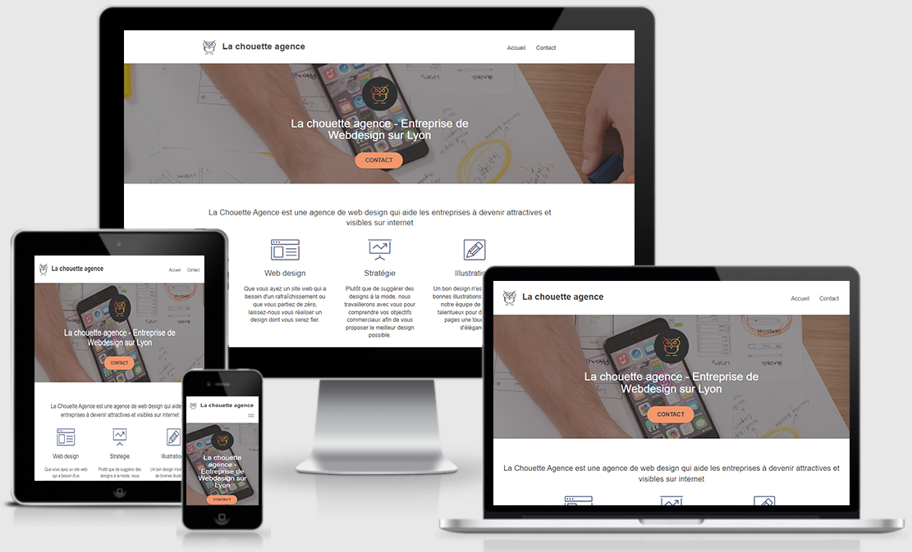

# Projet n°3 : Optimiser un site web existant

## :mag: Aperçu

## :bookmark_tabs: Sommaire
<ol>
    <li><a href="#sujet">Sujet</a></li>
    <li><a href="#demandes_respecter">Demandes à respecter</a></li>
    <li><a href="#objectifs_projet">Objectifs du projet</a></li>
    <li><a href="#technologies_utilisees">Technologies utilisées</a></li>
    <li><a href="#prerequis">Prérequis</a></li>
    <li><a href="#installation">Installation</a></li>
    <li><a href="#utilisation_siteweb">Utilisation du site web</a></li>
    <li><a href="#auteurs_contributeurs">Auteurs et contributeurs</a></li>
    <li><a href="#licence">Licence</a></li>
</ol>

## :page_facing_up: 1. Sujet 

Vous travaillez pour La chouette agence, une grande agence de web design basée à Lyon.

L’activité de l’entreprise a bien démarré mais aujourd’hui, elle est en perte de vitesse. Eh oui, la concurrence est rude.

La fondatrice de l’entreprise, Sophie, cherche une solution pour faire repartir l’activité. En tapant “Entreprise web design Lyon” sur Internet, elle s’aperçoit que le site de l’agence apparaît seulement en deuxième page des moteurs de recherche.

Par chance, un de vos collègues, Martin, lui a dit que vous étiez un spécialiste en référencement.

## :memo: 2. Demandes à respecter 

* Analyser l’état actuel au niveau SEO du site fourni.
* Suite à l'analyse, proposer 10 recommandations pour améliorer le site, et les réaliser.
* Au moins une recommandation doit traiter de l'accessibilité du site web.
* Le code HTML et CSS doit être maintenable.

## :checkered_flag: 3. Objectifs du projet 

* Approfondir ses connaissances en HTML, CSS, et SEO.
* Apprendre à optimiser la taille, la vitesse, et le référencement d'un site web, en utilisant des outils de développement comme Chrome DevTools.

## :computer: 4. Technologies utilisées 

* HTML
* Bootstrap
* CSS
* JavaScript
* Git & GitHub

## :exclamation: 5. Prérequis 

Aucun

## :wrench: 6. Installation 

Cloner ce repository.

## :question: 7. Utilisation du site web 

Ouvrir le fichier index.html sur un navigateur web.

## :beers: 8. Auteurs et Contributeurs 

Timoté Lancelle : [GitHub](https://github.com/LancelleTimote) / [LinkedIn](https://www.linkedin.com/in/timote-lancelle-devweb/)

## :page_with_curl: 9. Licence 

Distribué sous la licence MIT. Voir le fichier [LICENSE](LICENSE) pour plus d'informations.